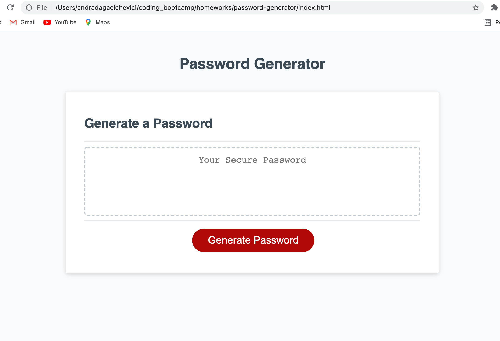
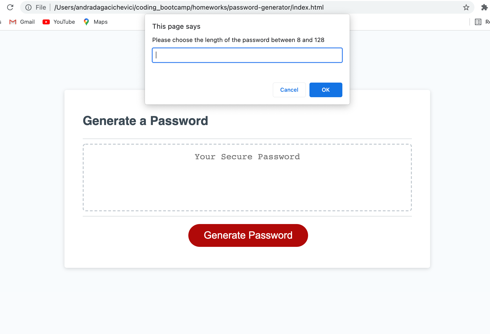
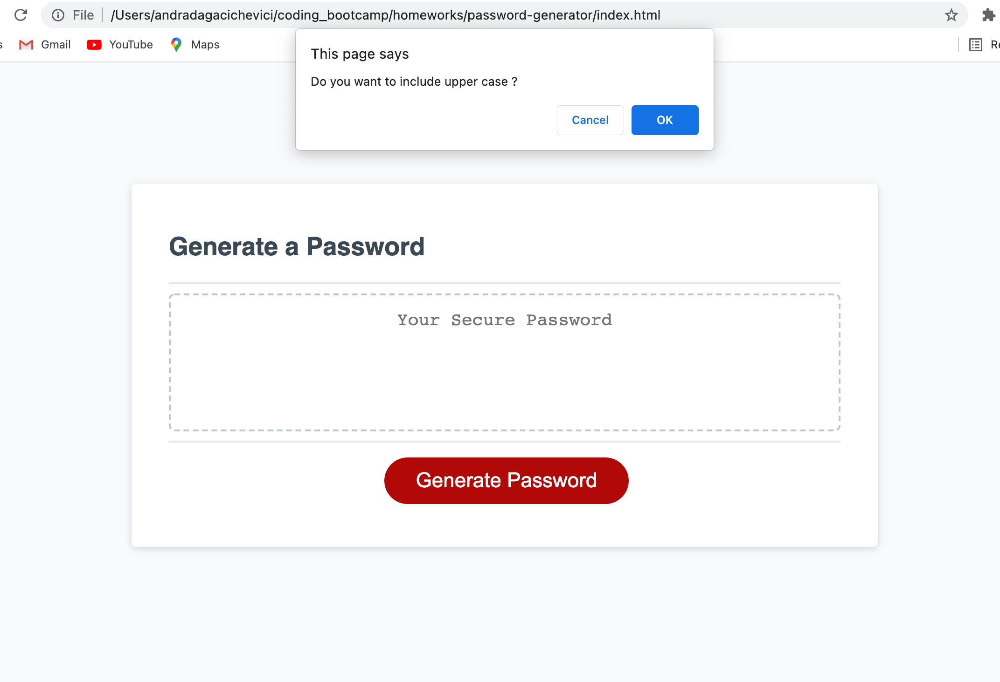
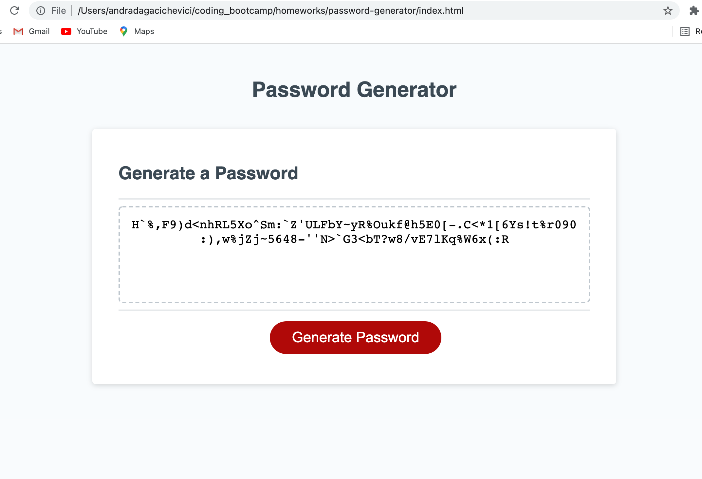

# Random Password Generator

An application using HTML, CSS and JS that enables employees to generate random passwords based on criteria that they've selected.

## Build With:

- HTML
- CSS
- Javascript

## How Is The User Selecting The Criteria

- Prompt (for text inputs)
- Confirm (for Yes/No)
- Alert (display info messages)

## User Flow:

- Click on generate password button
- Presented with criteria
- Fill in the criteria
- Password should appear on the page

The user has to click on the generate password button and then it will be presented with criteria.

The user confirms the length of the password, which shall be between 8 and 128.

If the user choose a number out of range, an alert will display an alert.

The user then confirms what criteria wants to use: numbers, lowercase, upercase or special characters.

The user must use at least one criteria.

Password should appear on the page.

## Deployed URL

You can view the GitHub pages deployed application [here](https://andradag.github.io/Password-Generator/).

## Screenshots

Click on generate password button

Fill the length criteria

Confirm the number criteria

Confirm the special character criteria

Confirm the lower case criteria

Confirm the upper case criteria

Password should appear on the page

